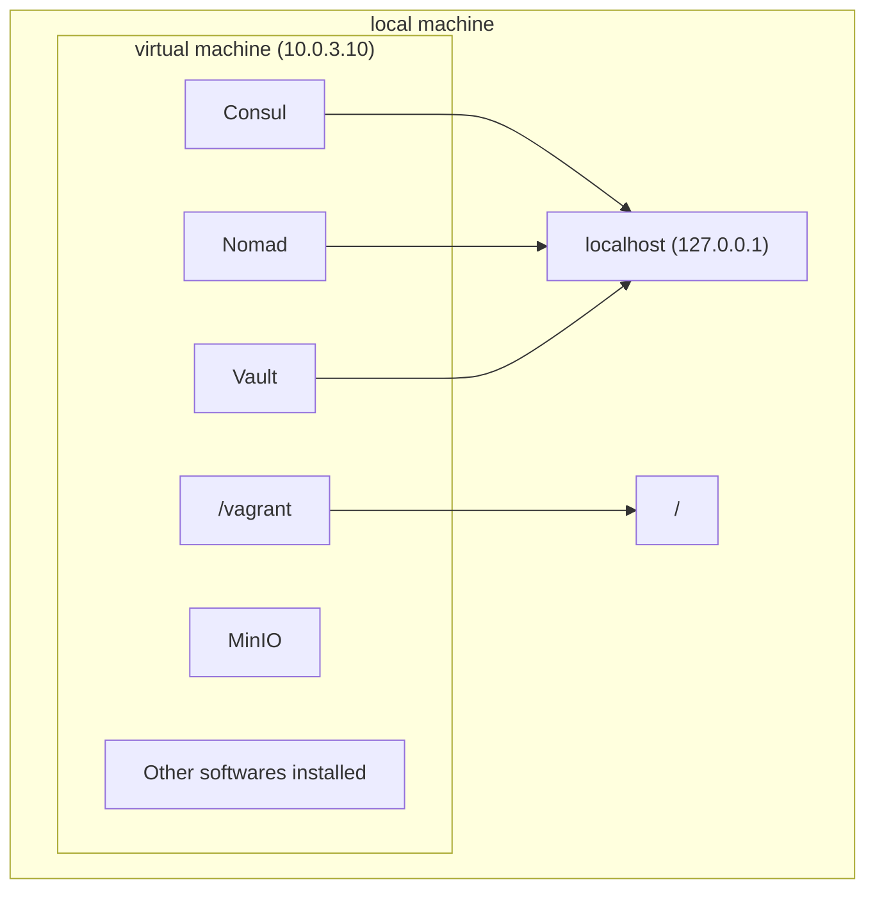

## Getting Started

### Goals of This Guide
The end goal of this guide is to create a **terraform module** that works seamlessly inside a **hashistack**
ecosystem.

> :bulb: **Hashistack**, in current repository context, is a set of software products by [HashiCorp](https://www.hashicorp.com/).

If our terraform module is going to work properly with the hashistack we obviously need to both develop and test it within that very ecosystem. In short requires a full setup of Vault, Consul, Nomad, Terraform, and many  other technologies. We solve that with [Vagrant](https://www.vagrantup.com/). Vagrant is a technology that allows us to   easily set up a virtual machine based on a pre-made vagrant-box that is created by code we write. In the repository    [vagrant-hashistack](https://github.com/fredrikhgrelland/vagrant-hashistack/) we have a set of code that produces the vagrant-box called `fredrikhgrelland/hashistack` which is availabe on the [Vagrant cloud](https://vagrantcloud.com /fredrikhgrelland/hashistack). To set up a virtual machine based on this box you can write `vagrant init fredrikhgrelland` then `ANSIBLE_ARGS='--extra-vars "local_test=true"' vagrant up`. The `ANSIBLE_ARGS='--extra-vars "local_test=truei'"` lets the box know we are running it locally. When this vagrant-box is finished setting up you will have a virtual machine running on your local machine with the hashistack fully set up and ready to go. Without Vagrant every user that wants to effectively develop modules would have had to set up and integrate all the technologies on their own computers.

 The template you found this README in is specificully built to make it as easy and quick as possible to make the aforementioned modules, and develop and test them within the vagrant-hashistack box. This guide aims to show you how to use this terraform modules. While building a terraform module using this template there are several steps you might want to take, listed below. The order is not random, but if you personally want to do it in another order, that is completely fine, and up to you. The most important part of this tutorial is that you get an introduction to what this template is, and how to use it. The steps we are going to walk through are as follows:

- Building a docker image
- Creating a nomad job that uses this image
- Creating the terraform module
- Making the nomad job more dynamic

### Vagrant box vs your local machine
It's important to note that your local machine and the running vagrant box (from now on called virtual machine) are two completely separate entities. The virtual machine is available at the IP `10.0.3.10` and our local machine is available at the IP `127.0.0.1` or alternatively `localhost`. To make things easier Consul, Nomad, and Vault all have been forwarded so that they are also available at `localhost`, in addition to the virtual machine's IP. MinIO has not been forwarded, and is only available at `10.0.3.10`.
Lastly, the virtual machine and local machine share the folder where the `Vagrantfile` lies, and will be mapped to `/vagrant` inside the virtual machine [ref](#synced-folder).

TODO: generate PNG


### Interacting with Nomad, Vault and Consul
When a vagrant box is set up the virtual machine is available at the IP `10.0.3.10`, and Nomad, Vault, and Consul all listen to their default ports, which are `4646`, `8200`, and `8500` respectively. In other words, you can reach nomad on `10.0.3.10:4646`, vault on `10.0.3.10:8200` and consul on `10.0.3.10:8500`. For convenience sake these services have been port forwarded (as mentioned earlier), meaning they are also available at `localhost`, on the same ports; Nomad then becomes `localhost:4646`, Vault `localhost:8200`, and so on. Nomad, Vault and Consul have their own CLI-tools used to interact with the servers that are running, and they default to `localhost`, and the default ports just mentioned. This means you can download any of the binaries, and they will be connected to the services running inside the virtual machine right from the get-go. Refer to [this section](#iteration-of-the-development-process) to see examples on how to use this.

### Using ansible
When working with this box we will use a technology called [ansible](https://www.ansible.com/). In short, ansible is a software that logs onto a computer like a normal user, and performs tasks defined in an ansible playbook (example [template_example/dev/ansible/playbook.yml](template_example/dev/ansible/playbook.yml). We will mostly be using this to interact with our virtual machine. In our case _all_ playbooks put inside [dev/ansible/](./dev/ansible/) will be run every time we start the box, and we will utilise this throughout the guide.

### Making artifacts availabe inside the box
#### MinIO
The virtual machine has MinIO set up. The service is available at `10.0.3.10`. Anything put in MinIO will be available to the box using MinIO. See [pushing docker image](#pushing-resources-to-minio-with-ansible-docker-image) and [fetching docker image](#fetching-resources-from-minio-with-nomad-docker-image) for examples on how to make a docker image available inside the box. We will be using this later in the guide.

#### Synced folder
As mentioned earlier the virtual machine and local machine have a folder that's shared. The folder which the `Vagrantfile` lies in is linked to `/vagrant` inside the box.

### Your First Running Virtual Machine
As a first step, and to get to knowing the virtual machine a little, try running 
```bash
make up
```
in your terminal. This will start the provisioning of the virtual machine. It'll spew out a bunch of information and after a little while it's finished. Try going to `localhost:8500` in your browser, and you should see a consul UI. The same goes for Nomad and Vault if you go to their ports, `4646` and `8200`. Voila, you got your very own hashistack running. We have now verified what's in the section [Interacting with Nomad, Vault and Consul](#interacting-with-nomad-vault-and-consul). Next, let's log onto our virtual machine with
```bash
vagrant ssh
```
You are now inside the box. Let's go to our `/vagrant` folder and an `ls`. Do you notice that it contains exactly the same things as the folder this README is in? As mentioned in [Synced folder](#synced-folder) this is a synced folder, which will come in handy later. Try also running `terraform --help`, `nomad --help`, and `vault --help`, and you'll see that they are all available as CLI-tools inside your virtual machine.


### The development process

#### 1. Building Docker Image

> :warning: This section is only relevant if you want to build your own docker image. Skip this if you are new.
> :warning: If you are not very familiar with the process of building images, we recommend using a simple [nginx](https://hub.docker.com/_/nginx) container for now.  

Most of the terraform modules will deploy one or more docker-containers to Nomad. Many will want to create their own docker images for this. The template supplies a [docker/](/docker/) folder to do this.

To build your own docker image start by adding a file named [`Dockerfile`](https://docs.docker.com/engine/reference/builder/) to [docker/](/docker/). You can then test and develop this image like you would with any other `Dockerfile`. Try and build this like any other docker-image by running `docker build ./docker` to see that everything is working properly. At this point we've got a docker image on our local machine, but as mentioned earlier the virtual machine and local machine are not the same thing. We need to get it into the virtual machine somehow. To do that we are going to archive it and put it into MinIO, which is on the virtual machine. You can jump to the next section to see how that is done.

#### 2. Deploying Container With Nomad
At this point you should have a service that will run when you start the docker container. Either you've made a container yourself, or you are using the nginx container. The next step is then to somehow deploy this container to our hashistack ecosystem. To do that we will use Nomad. Nomad is running inside our virtual machine, and is used to deploy containers, and register them into consul. It also has tight integration with vault. 

##### Making image available to Nomad

> :warning: Skip this if you are using the nginx container

After successfully building the docker image we want to create a nomad-job that takes this image and deploys it and registers it with consul, so that we have a running service. In the end this is what we want our terraform module to do, but we'll first do this manually to make sure everything is working before we try and wrap a terraform module around it. The image we built in our first step is now available as an image on our local machine, but our vagrant box does not have access to that. For all intents and purposes our local machine and the vagrant box are two different machines. In other words we need to somehow take our docker image, and make that available inside our box (because that is where the nomad server is running). To be able to transfer files from our local machine to the vagrant box we are going to use MinIO which was mentioned earlier. You can upload files from the UI in your browser, or we have also set it up so that all files put in the same directory as this README will be copied into MinIO. [This section](#pushing-resources-to-minio-with-ansible-docker-image) shows how we can use ansible code to first create a tmp folder, then build and archive our docker image in that tmp folder. Because the tmp folder is in the same directory as this README it'll automatically now be available in MinIO. Lucky for us, Nomad then has a way to extract images from MinIO and use them.

##### Creating a nomad job
Next step is to create the nomad job that deploys our image. This guide will not focus on how to make a nomad job, but a full example can be found at [template_example/conf/nomad/countdash.hcl](template_example/conf/nomad/countdash.hcl). Your nomad job-file should go under `conf/nomad/`. If you made your own docker image see [fetching docker image](#fetching-resources-from-minio-with-nomad-docker-image) on how to use that in your nomad job. When the nomad job-file has been created we can try and run it. We can do this one of two ways:

- Log on the machine with `vagrant ssh` and run it with the nomad-cli inside the virtual machine. Remember that all files inside `/vagrant` are shared with the folder of this `README`, meaning you can go to `/vagrant/conf/nomad` to find your hcl-file. Then run it with `nomad job run <nameofhcl.hcl>`.  
- If you have the nomad-cli on your local machine you can run it with `nomad job run <nameofhcl.hcl>`. 

After sending the job to nomad you can check the status of it by going to `localhost:4646`. There you will see your job running.

#### 3. Creating the Terraform Module
A terraform module normally consists of a minimum of three files, `main.tf`, `variables.tf`, `outputs.tf`. Technically we only need one, but it's customary to include at least these three. `main.tf` contains the resources used, `variables.tf` contains all variables used, and `outputs.tf` defines any output variables (if relevant). All files should be put in the root (same as the folder this README is in). Our goal now is to create a terraform module that will take an HCL-file and deploy it to a given Nomad. 


##### main.tf
In our case the only thing our main.tf should contain is a resource that takes our nomad-job file and deploys it to Nomad. To be able to use a resource that does this, we need to supply a [nomad provider](https://registry.terraform.io/providers/hashicorp/nomad/latest/docs), but we do not want to supply that with the module itself. We would rather that the place that is importing the module supplies it. When done this way it ensures that the module is not tied down to one single nomad-provider, but can be used in different configurations with different nomad-providers. Below is an example of how to take a nomad-job file and deploy it to Nomad:

```hcl-terraform
resource "nomad_job" "countdash" {
  jobspec = file("${path.module}/conf/nomad/countdash.hcl")
  detach  = false
}
```

`${path.module}` is the path to where our module is. `detach = false` tells terraform to wait for the service to be healthy in nomad before finishing. 


##### variables.tf

> :warning: In our first iteration of our terraform-module we don't need any input variables.

In this file you define any variables you would want to be input variables to your module. If we are provisioning a postgres service, maybe we'd like a "Name of postgres database" variable as input, or "Number of servers to provision" if you are provisioning a cluster.  A variable is defined like below:

```hcl-terraform
variable "service_name" {
  type        = string
  description = "Minio service name"
  default     = "minio"
}
```

##### outputs.tf

> :warning: In our first iteration of our terraform-module we don't need any output variables.

This files contains variables that will be available as outputs when you use a module. Below is first an example of
how to define output-variables, then an example of how to use a module, and access their output variables.
Defining output variables:

 ```hcl-terraform
output "nomad_job" {
  value       = nomad_job.countdash
  description = "The countdash nomad job object"
}
```

> :bulb: Together inputs and outputs should create a very clear picture of how a module should be used. For example in our hive module we have clearly defined that it needs to have a postgres-address as an input. In our postgres module we have an output that is exactly that. In other words, we might need to import and setup a postgres-module before setting up our hive-module, so that we get a postgres-address to give our hive-module. Or, if we already have a postgres-address available, we could supply that instead. The goal is to clearly define the needs of a module, while at the same time making it flexible and generic (in the example of hive we give the user the ability to use any postgres they'd like). How to use variables and outputs will be shown later in [make the module more dynamic]().

#### 4. Using a Terraform Module
At this point we have created three files (or one), `main.tf`, `variables.tf` and `outputs.tf`. Together they do one thing, which is start a nomad job. So in theory, we are done with our goal; create a terraform module. Almost. We still need to verify that it works the way we expect it to. What we now want to do is write some terraform code that runs the module we have now made, then run that code on our virtual machine. We will do this in two steps, first we will write the code that uses the module, go into the box and run the code manually, and lastly, write some ansible code that runs it automatically. The next lines of terraform code should be put in a `main.tf` under `example/` because this will be an example of how to use the module.

Below is an example on how to use a module:

 ```hcl-terraform
module "whatever" {
  source      = "github.com/fredrikhgrelland/terraform-nomad-minio.git?ref=0.0.3"
}
```

This will fetch the module at the given source, in the case above it is a MinIO module, version 0.0.3. 

Create a file called `main.tf` under the `example/` directory, and add the code above, change the module's name, and source. The source is `../` in this case because that is where our module files are, relative to the `main.tf` you are writing this in. 

Let's log onto our virtual machine and try and run it! Run `vagrant ssh` if needed, and navigate to your `/vagrant/example/` folder. Next run `terraform init` to initialize a terraform-workspace. When that is done you can try `terraform plan`, which will read your terraform code and attempt to make a runtime plan. When doing so you will get the error "Error: Missing required argument The argument "address" is required, but was not set.". This is because we are using a resource that deploys a nomad job, but nowhere in our terraform files have we defined _ what_ Nomad to use. At the moment no Nomad is known. This is where [providers]() come into the picture. They are providers for the resources we are using, and in our case we need to define a [Nomad provider](). We could do this in either of our `main.tf` files, but if we do it in our module's `main.tf` it will be very difficult for anyone to use our module, because the Nomad's address is predefined. Instead we should include what nomad to use in our example´s `main.tf`, which is simply an example of how to use the module, meaning anyone else wanting to use the module could supply their own nomad when using the module. To supply a provider add the lines below to your `example/main.tf` file:

```hcl-terraform
provider "nomad" {
  address = "http://127.0.0.1:4646"
}
```

we have now told terraform what Nomad we want to use. Try running your terraform code with `terraform init` (we need to load the nomad provider), `terraform plan` (this time it should succeed), then lastly `terraform apply`, which will execute the plan. Go to `localhost:4646` to check if the nomad-job has started running, if it has, congratulations, you have made your first working terraform module!


#### 5. Using Ansible To Run the Code in the Previous Step On Startup
Way earlier I mentioned that ALL ansible tasks put inside `dev/ansible/` will be run when the box starts. We can use this to automatically start our module when we run `make up`. The ansible code for running terraform code is below. Add this to `run-terraform.yml` or another aptly named file.

```yml
- name: Terraform
  terraform:
    project_path: ../../example
    force_init: true
    state: present
  register: terraform

- name: Terraform stdout
  debug:
    msg: "{{terraform.stdout}}"
```


#### 6. Making The Nomad Job More Dynamic With Terraform Variables

#### 7. Integrating The Nomad Job With Vault


#### Github Workflows
