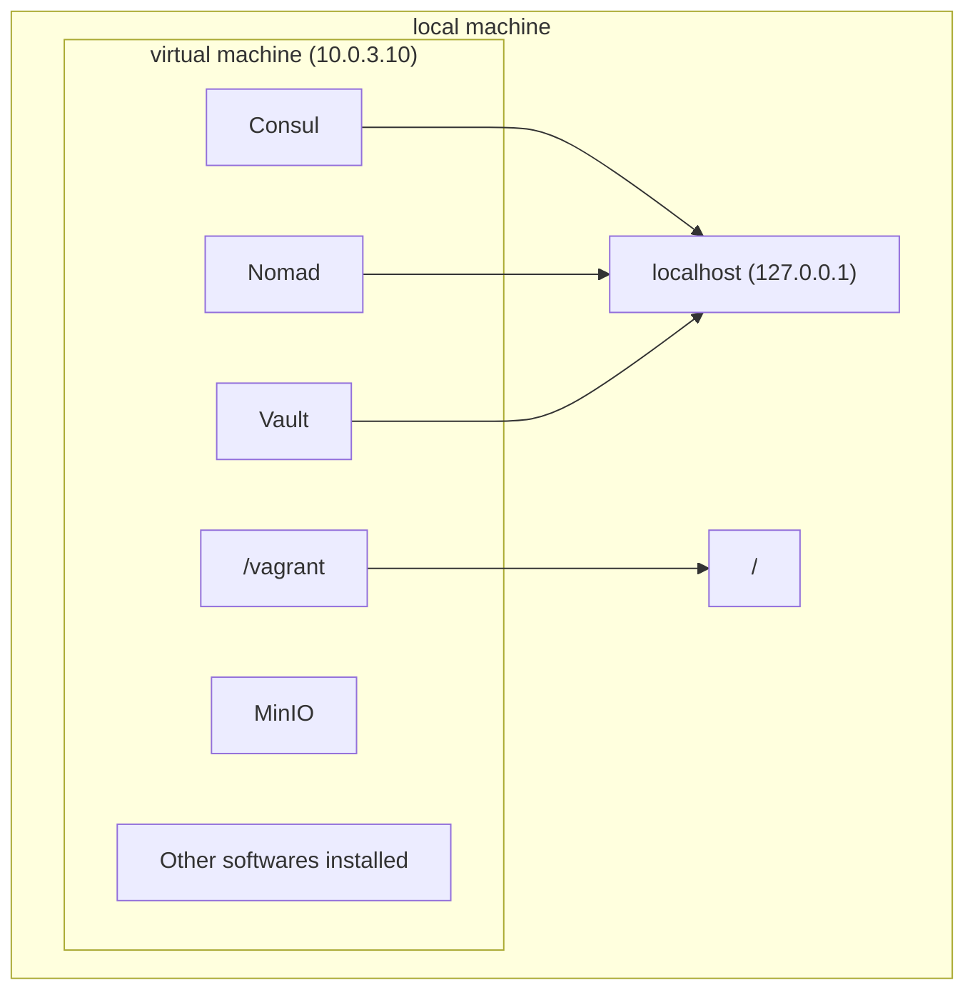

## Getting Started

### Goal of This Guide

Before anything, if you haven't, read the section `Description - what & why` in [README.md](/README.md).

> :bulb: **Hashistack**, in current repository context, is a set of software products by [HashiCorp](https://www.hashicorp.com/).

To create a terraform module that works seamlessly with the hashistack ecosystem, we need to both develop and test it within that very ecosystem. That requires a full setup of Vault, Consul, Nomad, Terraform, and many other technologies, which would be a chore to set up for every user. We solve this with [Vagrant](https://www.vagrantup.com/). Vagrant is a technology that allows us to easily set up a virtual machine based on a pre-made vagrant-box that is created by code we write. [vagrant-hashistack](https://github.com/fredrikhgrelland/vagrant-hashistack/) produces the vagrant-box called `fredrikhgrelland/hashistack` which is availabe on [Vagrant cloud](https://vagrantcloud.com/fredrikhgrelland/hashistack). 

The template you found this README in is specifically built to make it as easy and quick as possible to make terraform modules, and then test them inside the vagrant-hashistack box. 

This guide aims to show you how to use this template. The steps we are going to walk through are as follows: TODO:UPDATE THIS LIST

- Building a docker image
- Creating a nomad job that uses this image
- Creating the terraform module
- Making the nomad job more dynamic

### Vagrant box vs your local machine
It's important to note that your local machine and the running vagrant box (from now on called virtual machine) are two separate entities. The virtual machine is available at the IP `10.0.3.10` and our local machine is available at the IP `127.0.0.1`, or alternatively `localhost`.

TODO: generate PNG


### Services inside box
The virtual machine will have four services:
|Name|port|
|:--|:-:|
|Consul|8500|
|Vault|8200|
|Nomad|4646|
|MinIO|9000|

As mentioned the virtual machine can be reached at `10.0.3.10`, meaning the services will be available at `10.0.3.10:<port-number>`. For convenience Consul, Vault, and Nomad have all been forwarded to `localhost` as well, meaning they are available at `localhost:<port-number>`. MinIO has _not_ been forwarded.  

### CLI-tools
Nomad, Vault and Consul have their own CLI-tools to interact with the servers that are running. They all default to `localhost`, and the default ports mentioned above. This means you can download any of the binaries, and they will automatically be connected to the services running inside the virtual machine. Refer to [this section](#iteration-of-the-development-process) to see examples on how to use this.

### Using ansible
When working with this box we will use a technology called [ansible](https://www.ansible.com/). In short, ansible is a software that logs onto a computer like a normal user, and performs tasks defined in an ansible playbook (example [template_example/dev/ansible/playbook.yml](template_example/dev/ansible/playbook.yml). We will mostly be using this to interact with our virtual machine. In our case _all_ playbooks put inside [dev/ansible/](./dev/ansible/) will be run every time we start the box, and we will utilise this throughout the guide.

### Making artifacts available inside the box
As mentioned, the local and virtual machine are separate. To make something from our local machine (for example our code) available to the virtual machine we've got two options: 

#### 1. Synced folder
As mentioned earlier the virtual machine and local machine have a shared folder. In _all_ vagrant boxes the folder in which the `Vagrantfile` lies will be linked to `/vagrant` inside the box. In our case the `Vagrantfile` is in our root directory, the same as where this `getting_started.md` is.

#### 2. MinIO
Anything put in MinIO will be available to the virtual machine. Two methods are available to upload to MinIO: 

- 1. Upload files via the UI at `10.0.3.10:9000`. 
- 2. _All_ files put in the root directory (same as this file) will be automatically synced with MinIO

See [pushing docker image](#pushing-resources-to-minio-with-ansible-docker-image) and [fetching docker image](#fetching-resources-from-minio-with-nomad-docker-image) for examples on how to upload a docker image. We will be using this later in the guide.


### Your First Running Virtual Machine
As a first step try running 

```bash
make up
```

in your terminal. This will start the provisioning of the virtual machine. Wait until it is finished. Voila, you got your very own hashistack running. Try going to `localhost:8500` in your browser, and you should see a Consul UI. The same goes for Nomad and Vault if you go to their ports, `4646` and `8200`. Next, let's log onto our virtual machine with

```bash
vagrant ssh
```

You are now inside the virtual machine. Let's go to our `/vagrant` folder and do an `ls`. Notice that it contains exactly the same folders and files as the folder this guide is in. This is because it is a [Synced folder](#1-synced-folder) like mentioned earlier. Try also running `terraform --help`, `nomad --help`, and `vault --help`, and you'll see that the CLI-tools have been downloaded to the virtual machine.


### The development process

#### 1. Building Docker Image

> :warning: This section is only relevant if you want to build your own docker image. Skip this if you are new.

Most of the terraform modules will deploy one or more docker-containers to Nomad. If you want to create your own docker-image, put the [`Dockerfile`](https://docs.docker.com/engine/reference/builder/) under [docker/](/docker/).

#### 2. Deploying Container With Nomad
At this point you should have a service that will run when you start the docker container. TODO:ADD LINK TO SIMPLE CONTAINER TO USE FOR GUIDE Either you've made a container yourself, or you are using some other container. The next step is then to deploy this container to our hashistack ecosystem. Nomad is running inside our virtual machine, and is used to deploy containers, and register them into Consul. It also has a tight integration with vault that we will use later. 

##### Making image available to Nomad

> :warning: Skip this if you are using a pre-made container

The image we built in our first step is now available as an image on our local machine, but our virtual machine does not have access to that. We need to take our docker image and make that available inside our box (because that is where the nomad server is running). To be able to transfer files from our local machine to the vagrant box we are going to use MinIO which was mentioned earlier. As mentioned in [Making artifacts available](#2-minio) everything put in the root directory will be available in MinIO. [This section](#pushing-resources-to-minio-with-ansible-docker-image) shows how we can use ansible code to:

- 1. create a tmp folder 
- 2. build and archive our docker image in that tmp folder 

##### Creating a nomad job
Next step is to create the nomad job that deploys our image. This guide will not focus on how to make a nomad job, but a full example can be found at [template_example/conf/nomad/countdash.hcl](template_example/conf/nomad/countdash.hcl). Your nomad job-file should go under `conf/nomad/`. If you made your own docker image see [fetching docker image](#fetching-resources-from-minio-with-nomad-docker-image) on how to use that in your nomad job. When the nomad job-file has been created we can try and run it. We can do this one of two ways:

- Log on the machine with `vagrant ssh` and run it with the nomad-cli available on the virtual machine. Remember that all files inside `/vagrant` are shared with the folder of this file, meaning you can go to `/vagrant/conf/nomad` to find your hcl-file. Then run it with `nomad job run <nameofhcl.hcl>`.  
- If you have the nomad-cli on your local machine you can run it from your local machine directly with `nomad job run <nameofhcl.hcl>`. 

After sending the job to nomad you can check the status of it by going to `localhost:4646`. If you see your job running you can go to the next step.

#### 3. Creating the Terraform Module
Now that  we want to write a terraform module that when used by some other code will take the hcl-file and deploy the nomad-job to nomad.

A terraform module normally consists of a minimum of three files, `main.tf`, `variables.tf`, `outputs.tf`. Technically we only need one, but it's customary to include at least these three. `main.tf` contains the [resources](https://www.terraform.io/docs/configuration/resources.html) used, `variables.tf` contains all variables used, and `outputs.tf` defines any output variables (if relevant). All files should be put in the root (same as the folder this README is in). 


##### main.tf
In our case the only thing our main.tf should contain is a resource that takes our nomad-job file and deploys it to Nomad. Below is an example of such a resource:

```hcl-terraform
resource "nomad_job" "countdash" {
  jobspec = file("${path.module}/conf/nomad/countdash.hcl")
  detach  = false
}
```

`${path.module}` is the path to where our module is. `detach = false` tells terraform to wait for the service to be healthy in nomad before finishing. [Documentation on the resource used](https://registry.terraform.io/providers/hashicorp/nomad/latest/docs/resources/job).


##### variables.tf

> :warning: In the first iteration we don't need any input variables.

In this file you define any variables you would want to be input variables to your module. If we are provisioning a postgres service, maybe we'd like a "Name of postgres database" variable as input, or "Number of servers to provision" if you are provisioning a cluster.  A variable is defined like below:

```hcl-terraform
variable "service_name" {
  type        = string
  description = "Minio service name"
  default     = "minio"
}
```

##### outputs.tf

> :warning: In the first iteration we don't need any output variables.

This files contains variables that will be available as outputs when you use a module. Below is first an example of
how to define output-variables, then an example of how to use a module, and access their output variables.
Defining output variables:

 ```hcl-terraform
output "nomad_job" {
  value       = nomad_job.countdash
  description = "The countdash nomad job object"
}
```

> :bulb: Together inputs and outputs should create a very clear picture of how a module should be used. For example in our hive module we have clearly defined that it needs to have a postgres-address as an input. In our postgres module we have an output that is exactly that. In other words, we might need to import and setup a postgres-module before setting up our hive-module, so that we get a postgres-address to give our hive-module. Or, if we already have a postgres-address available, we could supply that instead. The goal is to clearly define the needs of a module, while at the same time making it flexible and generic (in the example of hive we give the user the ability to use any postgres they'd like). How to use variables and outputs will be shown later in [make the module more dynamic]().

#### 4. Using a Terraform Module
At this point we have created three files (or one): `main.tf`, `variables.tf` and `outputs.tf`. Together they do one thing, which is start a nomad job. So in theory, we are done with our goal; create a terraform module. Almost. We still need to verify that it works the way we expect it to. What we now want to do is write some terraform code that runs the module we have now made, then run that code on our virtual machine to see if it works. We will do this in two steps, first we will write the code that uses the module, go into the box and run the code manually, and lastly, write some ansible code that runs it automatically when you start the box. The next lines of terraform code should be put in a `main.tf` under `example/` because this will be an example of how to use the module.

Below is an example on how to use a module:

 ```hcl-terraform
module "whatever" {
  source      = "github.com/fredrikhgrelland/terraform-nomad-minio.git?ref=0.0.3"
}
```

This will fetch the module at the given source, in the case above it is a MinIO module, version 0.0.3. 

Create a file called `main.tf` under the `example/` directory, and add the code above, change the module's name, and source. The source is `../` in this case because that is where our module files are, relative to the `main.tf` you are writing this in. 

Let's log onto our virtual machine and try and run it! Run `vagrant ssh` if needed, and navigate to your `/vagrant/example/` folder. Next run `terraform init` to initialize a terraform-workspace. When that is done you can try `terraform plan`, which will read your terraform code and attempt to make a runtime plan. When doing so you will get the error "Error: Missing required argument The argument "address" is required, but was not set.". This is because we are using a resource that deploys a nomad job, but nowhere in our terraform files have we defined _ what_ Nomad to use. At the moment no Nomad is known. This is where [providers]() come into the picture. They are providers for the resources we are using, and in our case we need to define a [Nomad provider](). We could do this in either of our `main.tf` files, but if we do it in our module's `main.tf` it will be very difficult for anyone to use our module, because the Nomad's address is predefined. Instead we should include what nomad to use in our example´s `main.tf`, which is simply an example of how to use the module, meaning anyone else wanting to use the module could supply their own nomad when using the module. To supply a provider add the lines below to your `example/main.tf` file:

```hcl-terraform
provider "nomad" {
  address = "http://127.0.0.1:4646"
}
```

we have now told terraform what Nomad we want to use. Try running your terraform code with `terraform init` (we need to load the nomad provider), `terraform plan` (this time it should succeed), then lastly `terraform apply`, which will execute the plan. Go to `localhost:4646` to check if the nomad-job has started running, if it has, congratulations, you have made your first working terraform module!


#### 5. Using Ansible To Run the Code in the Previous Step On Startup
Way earlier I mentioned that ALL ansible tasks put inside `dev/ansible/` will be run when the box starts. We can use this to automatically start our module when we run `make up`. The ansible code for running terraform code is below. Add this to `run-terraform.yml` or another aptly named file.

```yml
- name: Terraform
  terraform:
    project_path: ../../example
    force_init: true
    state: present
  register: terraform

- name: Terraform stdout
  debug:
    msg: "{{terraform.stdout}}"
```


#### 6. Making The Nomad Job More Dynamic With Terraform Variables
TODO

#### 7. Integrating The Nomad Job With Vault
TODO

#### CI/CD Pipline To Continuously Test The Module When Changes Are Made
TODO
